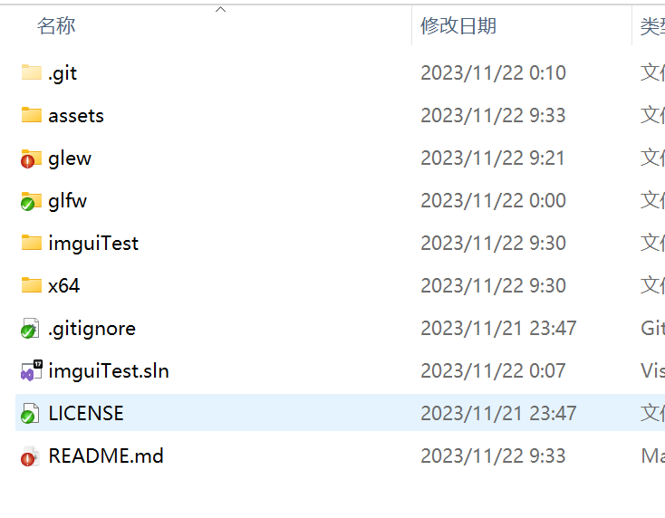
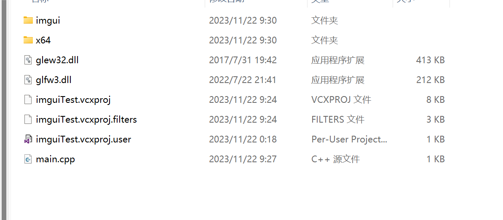
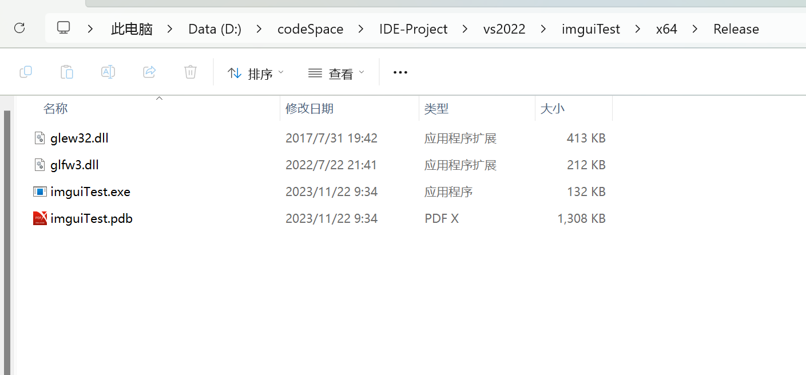

# imgui-template-vs2022
​	imgui配置vs2022模板

## 1. 复制文件夹

### 1.1 glew和glfw

​	复制这两个文件夹到项目根目录



### 1.2 imgui

​	复制该文件夹到项目目录（与main.cpp同级）

## 2. 复制dll

​	复制glew32.dll和glfw3.dll到main.cpp同级



​	再次复制，到根目录的/x64/Release下（需要运行一次才会生成）。



## 3. 添加include

​	将glew和glfw添加到include目录中

​	将imgui添加到include目录中

## 4. 添加链接lib和头文件

```c++
#include "GL\glew.h"
#include "GLFW\glfw3.h"

#pragma comment(lib, "../glew/glew32.lib")
#pragma comment(lib, "../glfw/lib-vc2022/glfw3.lib")
#pragma comment(lib, "Opengl32.lib")

#include "imgui.h"
#include "imgui_impl_glfw.h"
#include "imgui_impl_opengl3.h"

int main()
{

}
```

## 5. 完整实例

```C++
```

